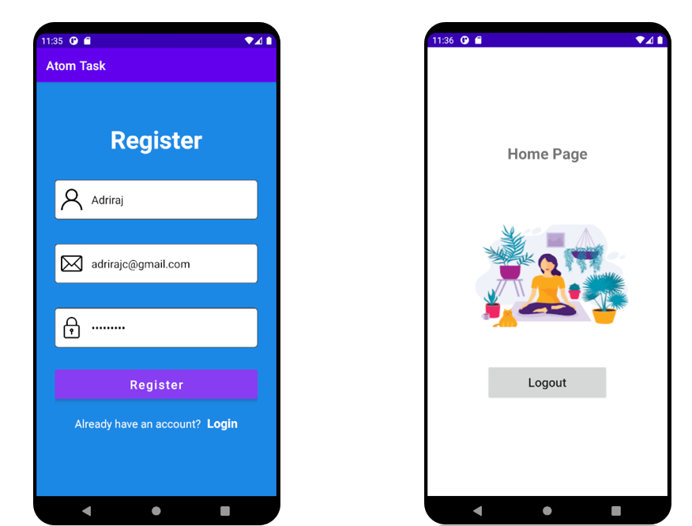

# Tech Task Atom

# Features
<li>User can register with his name,email and password</li>
<li>Authentication part and cloud storage is achieved using Firebase</li>
<li>Added validators for email,name,password</li>
<li>After user registers a new account or login with an existing account,he/she is redirected to the home page</li>
<li>On reaching home page,user can logout from his account.</li> 

# Built with
<li>Java</li>
<li>Android Studio</li>

# ScreenShots

